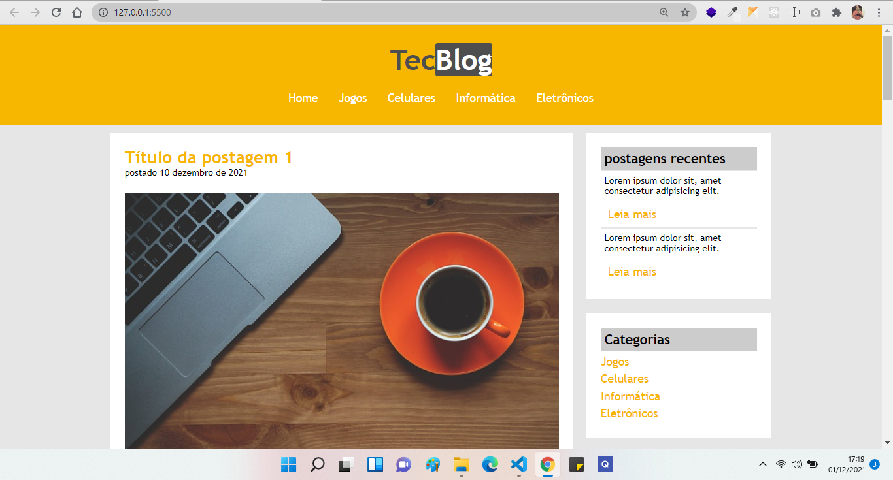

# Projeto tecblog
## Projeto de estudos na parte de HTML e CSS.

 
 

---

---
## 🌟 Tecnologias 

Projeto foi desenvolvido com as seguintes tecnologias

- [HTML](https://www.w3schools.com/html/html5_intro.asp)
- [CSS](https://www.w3schools.com/css/css_intro.asp)

---
## Como executar:

- Clone o repositório
- rode o arquivo index.html 

---

criado por Anderson Jorge,  em Dezembro de 2021.